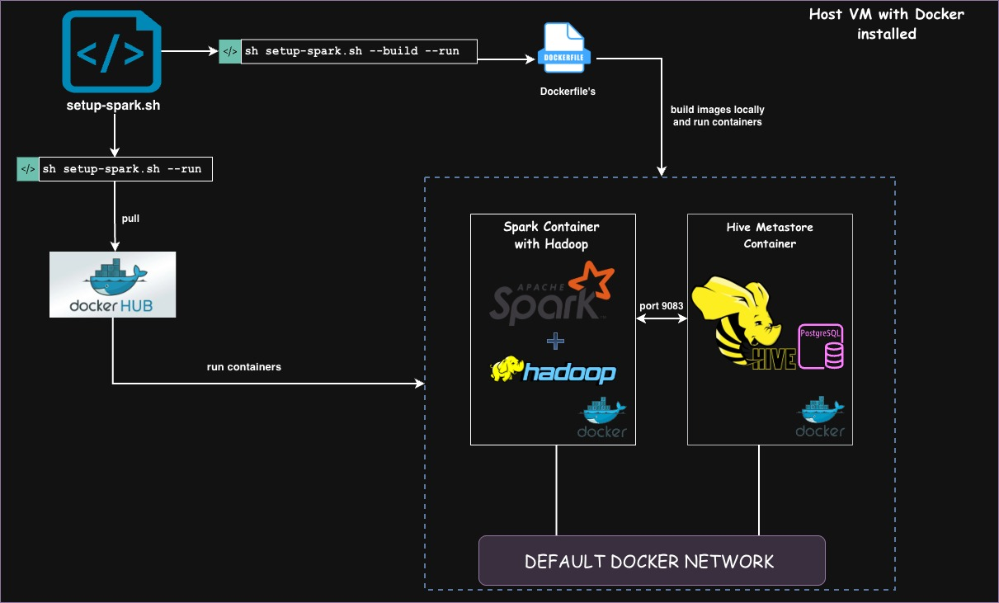

<div class="hero">
  <h1>Spark with Hadoop on Docker</h1>
  <p><strong> A production-ready, version-pinned Spark + Hadoop + Hive stack on Docker, fully aligned with the open-source Spark versions used by Databricks Runtime (DBR). Deploy it on any machine within minutes using a single command. </strong></p>
</div>

<div style="text-align: center; margin: 2rem 0;">
  <div style="display: flex; justify-content: center; align-items: center; gap: 1.5rem; flex-wrap: wrap; margin-bottom: 1rem;">
    <div style="text-align: center;">
      
      <br>
      <span class="badge">Docker</span>
    </div>
    <div style="text-align: center;">
      
      <br>
      <span class="badge">Apache Spark</span>
    </div>
    <div style="text-align: center;">
      
      <br>
      <span class="badge">Hadoop HDFS</span>
    </div>
    <div style="text-align: center;">
      
      <br>
      <span class="badge">Apache Hive</span>
    </div>
    <div style="text-align: center;">
      
      <br>
      <span class="badge">Shell Script</span>
    </div>
  </div>
</div>

---

## **Introduction**

This project `Spark with Hadoop Anywhere` provides a production‑like Spark + Hadoop + Hive stack deployed in Docker  containers that closely mirror real-world Spark environments with one command so that you can develop, test, and demo locally. 

Each branch in this project corresponds to a specific **Spark / Scala /Java** combination (aligned with spark versions used in **DBR runtimes**), giving you a portable environment for:
- Debugging and developing Spark applications locally without cloud dependencies
- Implement and test new features on third party libraries integrated with spark environment
- Creating/Reproducing issues related to Databricks / Spark OSS
- Unit/Regression testing across multiple Spark versions with ease
- Safe environment for experimentation without affecting shared clusters

---

## **Table of Contents**

- [User Challenges](#user-challenges)
- [Motivation](#motivation)
- [Design Goals](#design-goals)
- [Architecture](#architecture)
- [DBR underlying Spark OSS Compatible Branches](#dbr-underlying-spark-oss-compatible-branches)
- [What Makes This Different](#what-makes-this-different)
- [Use Cases](#use-cases)
- [Getting Started](#getting-started)
- [Working with the Stack](#how-to-use)
- [Project Layout](#project-layout)
- [Limitations](#limitations)
- [Author](#author)

---

## **User Challenges**

Below are some real-world challanges users face:

<div class="feature-grid">
  <div class="feature-box">
    <h4>Third-Party Library Compatibility</h4>
    <p>Some libraries work well with open-source Apache Spark but fail on Databricks. How can developers reproduce and debug these issues locally?</p>
  </div>
  <div class="feature-box">
    <h4>Behavioral Differences</h4>
    <p>How can we reproduce and compare behavioral differences between Databricks and on-premises Spark environments, especially when using Delta Lake or other extensions?</p>
  </div>
  <div class="feature-box">
    <h4>Feature Development and Testing</h4>
    <p>Developers often need to build new features or integrations (e.g., Delta, MongoDB, Redshift) on open-source Spark and run minimal tests before production deployment.</p>
  </div>
  <div class="feature-box">
    <h4>End-to-End ETL Pipeline Development</h4>
    <p>How can I implement a complete ETL pipeline—including Airflow, Kafka, and Spark with minimal data locally for experimentation and testing?</p>
  </div>
  <div class="feature-box">
    <h4>Regression Testing Across Spark Versions</h4>
    <p>If an issue occurs in Spark 4.0.0 on-premises, how can I easily test it locally and verify whether it also exists in Spark 3.5.x?</p>
  </div>
  <div class="feature-box">
    <h4>Learning and Enablement</h4>
    <p>How can I get a cluster-like local environment to learn Spark concepts and experiment safely?</p>
  </div>
</div>

---

## **Motivation**

Modern data platforms (Databricks, EMR, on-prem Hadoop) are:

- **Version-sensitive**: Subtle behavior changes across Spark / Scala / Java versions
- **Heavily integrated**: Jobs depend on HDFS, Hive Metastore, JDBC sources, cloud storage, etc.
- **Expensive to experiment with**: Spinning up a full cluster just to debug an edge case is overkill

Typical local setups (e.g., just `spark-shell` on a laptop or a single generic Spark image) lack:

- A realistic HDFS layer
- A proper Hive Metastore
- Alignment with the **exact** versions used in production (EMR,underlying Databricks Runtime etc.)

<div class="highlight-box">
<strong>Spark with Hadoop Anywhere</strong> bridges that gap by providing <strong>low-friction, version-accurate, reproducible</strong> stacks you can run anywhere Docker is installed.
</div>

---

## **Design Goals**

The project is built around these core principles:

### 1. Version Fidelity

- Every branch is pinned to a specific **Spark / Scala / Java** combination
- DBR-compatible branches are explicitly documented
- No version guessing or runtime configuration

### 2. Minimal but Realistic

- Single-node topology, but with **real HDFS and Hive Metastore** semantics
- Enough moving parts to reproduce production issues without cluster overhead
- All core components working together as they would in production

### 3. Quick Setup

- A single script (`setup-spark.sh`) orchestrates build and run
- Docker images are buildable from scratch (no opaque base images)
- Easy to share exact environments for bug reports

### 4. Isolation

- No dependency on host-installed Spark, Hadoop, or Java
- All tooling and config live inside containers
- Clean slate for each version/branch

### 5. Extensibility

- Easy to add connectors (JDBC jars, Kafka clients, Delta Lake, etc.)
- Easy to fork and create new branches for future Spark/DBR versions
- Straightforward Dockerfile modifications

---

# **Architecture**

Each branch provides a logically similar architecture with version-specific artifacts:



There are two containers as you see in the architectural diagram above:

## Spark Container

This container runs the below three services:

#### Spark
  
  - Spark runs in **standalone mode** (master + worker in a single container)
  - Spark distributions are wired to the Hadoop client classpath
  - Configurable through standard `spark-defaults.conf`, `spark-env.sh`, etc.
  
#### Hadoop (HDFS)
  
  - Single-node HDFS **namenode + datanode**
  - Backed by container-local storage paths (no external FS required)
  - Bootstrapped at startup with **format-once** pattern and idempotent initialization

#### Hive CLI
  
  - Hive CLI and Beeline available inside the Spark container
   
## Hive metastore Container

**External Hive Metastore** backed by PostgreSQL in a dedicated container
  - `hive-site.xml` configured for:
    - Metastore DB credentials
    - Metastore host/port
    - Shared warehouse location

## **Container Orchestration**

- `docker-compose.yml` wires together all services
- Readiness checks ensure proper startup order
- One-command setup and teardown

---

## **DBR underlying Spark OSS Compatible Branches**

Branches are curated to align with **Databricks Runtime (DBR)** and underlying **OSS Spark** versions.

<div style="width: 100%; overflow-x: auto;">
<table style="width: 100%; border-collapse: collapse;">
<thead>
<tr style="background: linear-gradient(135deg, #155799, #159957); color: white;">
<th style="padding: 12px; text-align: left; border: 1px solid #ddd;">DBR Version</th>
<th style="padding: 12px; text-align: left; border: 1px solid #ddd;">Spark OSS Version</th>
<th style="padding: 12px; text-align: left; border: 1px solid #ddd;">Scala Version</th>
<th style="padding: 12px; text-align: left; border: 1px solid #ddd;">Java Version</th>
<th style="padding: 12px; text-align: left; border: 1px solid #ddd;">Compatible Branch in the Repository</th>
</tr>
</thead>
<tbody>
<tr>
<td style="padding: 12px; border: 1px solid #ddd;"><strong>13.3</strong></td>
<td style="padding: 12px; border: 1px solid #ddd;">3.4.1</td>
<td style="padding: 12px; border: 1px solid #ddd;">2.12</td>
<td style="padding: 12px; border: 1px solid #ddd;">8</td>
<td style="padding: 12px; border: 1px solid #ddd;"><a href="https://github.com/AnudeepKonaboina/spark-with-hadoop-anywhere/tree/spark-3.4.1" target="_blank"><code>spark-3.4.1</code></a></td>
</tr>
<tr style="background-color: #f8f8f8;">
<td style="padding: 12px; border: 1px solid #ddd;"><strong>14.3</strong></td>
<td style="padding: 12px; border: 1px solid #ddd;">3.5.0</td>
<td style="padding: 12px; border: 1px solid #ddd;">2.12</td>
<td style="padding: 12px; border: 1px solid #ddd;">8</td>
<td style="padding: 12px; border: 1px solid #ddd;"><a href="https://github.com/AnudeepKonaboina/spark-with-hadoop-anywhere/tree/spark-3.5.0" target="_blank"><code>spark-3.5.0</code></a></td>
</tr>
<tr>
<td style="padding: 12px; border: 1px solid #ddd;"><strong>15.4</strong></td>
<td style="padding: 12px; border: 1px solid #ddd;">3.5.0</td>
<td style="padding: 12px; border: 1px solid #ddd;">2.12</td>
<td style="padding: 12px; border: 1px solid #ddd;">8</td>
<td style="padding: 12px; border: 1px solid #ddd;"><a href="https://github.com/AnudeepKonaboina/spark-with-hadoop-anywhere/tree/spark-3.5.0" target="_blank"><code>spark-3.5.0</code></a></td>
</tr>
<tr style="background-color: #f8f8f8;">
<td style="padding: 12px; border: 1px solid #ddd;"><strong>16.4</strong></td>
<td style="padding: 12px; border: 1px solid #ddd;">3.5.2</td>
<td style="padding: 12px; border: 1px solid #ddd;">2.12</td>
<td style="padding: 12px; border: 1px solid #ddd;">17</td>
<td style="padding: 12px; border: 1px solid #ddd;"><a href="https://github.com/AnudeepKonaboina/spark-with-hadoop-anywhere/tree/spark-3.5.2-scala-2.12" target="_blank"><code>spark-3.5.2-scala-2.12</code></a></td>
</tr>
<tr>
<td style="padding: 12px; border: 1px solid #ddd;"><strong>16.4</strong></td>
<td style="padding: 12px; border: 1px solid #ddd;">3.5.2</td>
<td style="padding: 12px; border: 1px solid #ddd;">2.13</td>
<td style="padding: 12px; border: 1px solid #ddd;">17</td>
<td style="padding: 12px; border: 1px solid #ddd;"><a href="https://github.com/AnudeepKonaboina/spark-with-hadoop-anywhere/tree/spark-3.5.2-scala-2.13" target="_blank"><code>spark-3.5.2-scala-2.13</code></a></td>
</tr>
<tr style="background-color: #f8f8f8;">
<td style="padding: 12px; border: 1px solid #ddd;"><strong>17.x</strong></td>
<td style="padding: 12px; border: 1px solid #ddd;">4.0.0</td>
<td style="padding: 12px; border: 1px solid #ddd;">2.13</td>
<td style="padding: 12px; border: 1px solid #ddd;">17</td>
<td style="padding: 12px; border: 1px solid #ddd;"><a href="https://github.com/AnudeepKonaboina/spark-with-hadoop-anywhere/tree/spark-4.0.0" target="_blank"><code>spark-4.0.0</code></a></td>
</tr>
</tbody>
</table>
</div>

> **Tip:** Use the closest match to your target DBR. For binary compatibility (especially for UDFs, UDAFs, and custom libs), ensure the **Scala version** also matches.

---

## **What Makes This Different**

There are many Spark Docker images, but this project specifically targets **data platform engineers, SREs,support engineers,developers** working on real world pipelines involiving data analytcis.

### 1. Complete Stack, Not Just Spark

<div class="highlight-box">
You get a <strong>full analytics node</strong>: Spark + HDFS + Hive Metastore + CLI tooling, crucial for debugging:
<ul>
  <li>OSS Spark and related library issues</li>
  <li>DBR related spark issues</li>
  <li>HDFS issues</li>
  <li>Hive Metastore state and table metadata issues</li>
</ul>
</div>

### 2. Version-Driven Branches

- Branches are tied to underlying **OSS Spark/Scala/Java** 
- You don't pass `SPARK_VERSION` at runtime; you **switch Git branches**  

### 3. Reproducibility-First Design

- Single entry script: `setup-spark.sh`
- No hidden global dependencies; everything is in containers and repo
- Easy to zip up as a minimal reproducible environment

---

## **Use Cases**

### 1. Reproducing Databricks / DBR Behavior Locally

<div style="background: linear-gradient(135deg, #f5f5f5, #ffffff); border-left: 4px solid #159957; padding: 1.5rem; margin: 1.5rem 0; border-radius: 4px; box-shadow: 0 2px 8px rgba(0,0,0,0.1);">

<h4 style="color: #e74c3c; font-weight: 600; margin-top: 0;">Problem</h4>

<p>You hit a bug on DBR 16.4 and need a deterministic environment to:</p>

<ul>
<li>Validate if it's an OSS Spark issue vs Databricks-specific behavior</li>
<li>Isolate a minimal repro without exposing production data</li>
<li>Iterate quickly without burning cluster compute</li>
</ul>

<h4 style="color: #27ae60; font-weight: 600; margin-top: 1rem;">Solution</h4>

<ol>
<li>Check out the branch mapped to <code>Spark 3.5.2 / Scala 2.12 or 2.13 / Java 17</code></li>
<li>Spin up the stack with <code>setup-spark.sh</code></li>
<li>Load synthetic/anonymized data into HDFS/Hive</li>
<li>Run the same job logic and compare behavior</li>
</ol>

</div>

### 2. Validating Cross-Version Behavior

<div style="background: linear-gradient(135deg, #f5f5f5, #ffffff); border-left: 4px solid #159957; padding: 1.5rem; margin: 1.5rem 0; border-radius: 4px; box-shadow: 0 2px 8px rgba(0,0,0,0.1);">

<h4 style="color: #e74c3c; font-weight: 600; margin-top: 0;">Problem</h4>

<p>Upgrading DBR (or straight OSS Spark) and need to understand:</p>

<ul>
<li>Behavior changes in ANSI mode, SQL planner, shuffle behavior, etc.</li>
<li>API changes impacting your libraries</li>
<li>Performance regressions</li>
</ul>

<h4 style="color: #27ae60; font-weight: 600; margin-top: 1rem;">Solution</h4>

<ol>
<li>Run the same workload against multiple branches (e.g., <code>spark-3.4.1</code> vs <code>spark-3.5.2-scala-2.13</code>)</li>
<li>Compare:
<ul>
<li>Query plans</li>
<li>Logs and metrics</li>
<li>Output correctness</li>
</ul>
</li>
</ol>

</div>

### 3. Minimal Reproducible Examples (MREs)

<div style="background: linear-gradient(135deg, #f5f5f5, #ffffff); border-left: 4px solid #159957; padding: 1.5rem; margin: 1.5rem 0; border-radius: 4px; box-shadow: 0 2px 8px rgba(0,0,0,0.1);">

<h4 style="color: #e74c3c; font-weight: 600; margin-top: 0;">Problem</h4>

<p>You want to open a GitHub issue or vendor ticket and must provide:</p>

<ul>
<li>Exact Spark / Scala / Java versions</li>
<li>Exact configuration</li>
<li>Simple dataset + script/notebook</li>
</ul>

<h4 style="color: #27ae60; font-weight: 600; margin-top: 1rem;">Solution</h4>

<ol>
<li>Use this repo + branch as the environment contract</li>
<li>Share:
<ul>
<li>Branch name</li>
<li><code>setup-spark.sh</code> invocation</li>
<li>A small dataset and job script</li>
</ul>
</li>
<li>Others can clone the same branch and reproduce the behavior exactly</li>
</ol>

</div>

### 4. Training and Onboarding

<div style="background: linear-gradient(135deg, #f5f5f5, #ffffff); border-left: 4px solid #159957; padding: 1.5rem; margin: 1.5rem 0; border-radius: 4px; box-shadow: 0 2px 8px rgba(0,0,0,0.1);">

<h4 style="color: #e74c3c; font-weight: 600; margin-top: 0;">Problem</h4>

<p>New team members need a safe environment to:</p>

<ul>
<li>Learn Spark + HDFS + Hive interactions</li>
<li>Experiment with different table layouts and partitioning strategies</li>
<li>Understand Metastore and catalog behavior</li>
</ul>

<h4 style="color: #27ae60; font-weight: 600; margin-top: 1rem;">Solution</h4>

<ol>
<li>One command brings up a single-node analytics stack</li>
<li>Nothing is shared; you can destroy and recreate at will</li>
<li>Ideal for internal training or "Spark archeology" on older versions</li>
</ol>

</div>

---

# **Getting Started**

### Prerequisites

Make sure you have these tools installed by following the installation steps in the [README](https://github.com/AnudeepKonaboina/spark-with-hadoop-anywhere?tab=readme-ov-file#pre-requisites) file and then verify the istallation:
- Docker Engine
- Docker Compose (or `docker-compose` plugin)
- Git

```
docker --version
docker-compose version
git --version
```

---

### Step-1: Clone and Choose a Branch

Choose a branch based on the spark version you want to install , you can refer to the table [DBR underlying Spark OSS Compatible Branches](#dbr-underlying-spark-oss-compatible-branches) and pick the branch based on your **Spark** version.

```bash
git clone -b spark-2.4.7 https://github.com/AnudeepKonaboina/spark-with-hadoop-anywhere.git && cd spark-with-hadoop-anywhere/
```

### Step-2: Configure Secrets (hive metastore password) 

```
mkdir -p secrets
echo "<your_strong_password_here>" > secrets/postgres_password.txt
```

### Step-3: Run the Setup Script

There are two ways of running the setup script

**Option A: Uses prebuilt images from docker hub (fast setup and recommended)**

```
sh setup-spark.sh --run
```

**Option B: Build's images locally**

```
sh setup-spark.sh --build --run
```

This will:
- Build/pull Docker images
- Start containers using Docker Compose
- Initializes Spark,HDFS and Hive Metastore
- Verify all services are healthy

### Step-4: Verify Running Containers

Once the setup is completed 
```bash
docker ps
```
You should see two containers:
- A `spark` container
- A `hive-metastore` container

---

# **How to use**

### Connect to the Spark container using the below command:

```
docker exec -it spark bash
```

## Spark

To start a Spark shell:

```
# Scala shell
spark-shell

# Python shell
pyspark

# Submit a spark job
spark-submit --class com.example.MyApp my-app.jar
```

Access the Spark UI at `http://localhost:4040`

---

## HDFS

Use the HDFS CLI inside the container:

```
hdfs dfs -ls /
hdfs dfs -mkdir -p /user/$(whoami)
hdfs dfs -put /opt/data/sample.parquet /user/$(whoami)/
hdfs dfs -cat /user/$(whoami)/sample.parquet | head
```

---

## Hive 

Use Hive CLI or Beeline:

```
# Hive CLI
hive

# Beeline (JDBC)
beeline -u jdbc:hive2://localhost:10000/default
```

Example queries you can run:

```sql
-- Create a table
CREATE TABLE IF NOT EXISTS employees (
  id INT,
  name STRING,
  department STRING
) STORED AS PARQUET;

-- Query from Spark
SELECT * FROM employees LIMIT 10;
```

---

## **Extending the Stack**

Common extension patterns:

### Add Custom Jars

```dockerfile
# Extend the Dockerfile
FROM anudeepkonaboina/spark-hadoop-standalone:spark-3.5.2

COPY custom-jars/*.jar ${SPARK_HOME}/jars/
```

### Mount Host Directories

```yaml
# docker-compose.yml
services:
  spark:
    volumes:
      - ./data:/opt/data
      - ./jars:/opt/jars
```

### Add more services to extend the stack

Yonu can add more data egineering services to the docker-compsoe file and build a complete End-to-end data eng tech stack on Docker

```bash

services:
  spark:
    volumes:
      - ./data:/opt/data
      - ./jars:/opt/jars
  kafka:
       --
  hbase:
       --
  airflow:

```

---


# **Project Layout**

```text
spark-with-hadoop-anywhere/
├── docker-compose.yml          # Orchestration
├── setup-spark.sh              # Entry script
├── spark-hadoop-standalone/
│   ├── Dockerfile              # Spark/Hadoop/Hive image
│   └── configs/                # Config files
├── secrets/                    # (Git-ignored) secret files
├── images/                     # Architecture diagrams
└── docs/                       # GitHub Pages site
```

---

## **Limitations**

- **Not a production deployment template**: No HA, no multi-node replication, no built-in security hardening
- **Single-node semantics**: Useful for functional correctness, less representative for large-scale performance testing
- **No direct Databricks features**: DBR-compatible at the Spark level only, not the control plane
- **Not cloud-specific**: No opinionated integration with S3/ADLS/GCS by default (though you can add it)

---

## **Author**

**Anudeep Konaboina**

- GitHub: [@AnudeepKonaboina](https://github.com/AnudeepKonaboina)
- Project: [Spark with Hadoop Anywhere](https://github.com/AnudeepKonaboina/spark-with-hadoop-anywhere)

---

<div style="text-align: center; margin: 3rem 0;">
  <p><strong>If this project helps you debug a tricky Spark/Hive/HDFS issue or reproduce a DBR bug, please star the repository!</strong></p>
</div>

---

<div style="text-align: center; color: #666; font-size: 0.9rem; margin-top: 2rem;">
  <p>© 2025 Anudeep Konaboina | Licensed under Apache 2.0</p>
</div>
